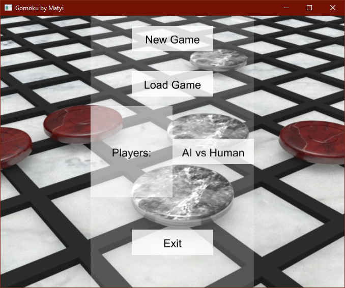
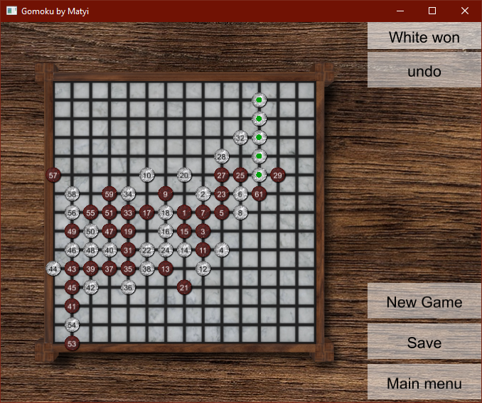

# Gomoku
Gomoku game with AI written in Rust. This project was a collaboration with Réka Fülöpp, who created the artwork.
The UI is built on [glui](https://github.com/frontier789/glui.git).

The AI uses shallow threat-space search, it can beat beginner players. 

## Compilation
The project requires cargo, to compile simply call `cargo build` in the root of the project.
To run the code, call `cargo run --release`

## Screenshots
The main menu

---
White won!

## Acknowledgement
Game created by Mátyás Komáromi

Graphics by Réka Fülöpp
